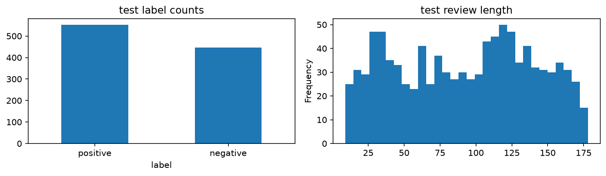

# Amazon Reviews Sentiment Analysis

Binary sentiment classification on [Cleanlab/amazon-reviews](https://huggingface.co/datasets/Cleanlab/amazon-reviews) (5k train / 1k test).

Pipeline: ETL, optional Cleanlab label-issue detection, TF-IDF plus LogisticRegression candidates on `train_dev`, validation selection, refit on `train_dev` union `val`, then test evaluation. Downloads are pinned to Hugging Face revision `bca513e6ecd76a4051dfb80445ff0b0083c6be35`.

Cleanlab is detection-only unless you set `CLEANLAB_REMOVE_IDS` in the setup cell to flagged `source_row_id` values, then restart the kernel and Run All. The Cleanlab cell resets `train_dev` from `train_clean` and drops prior `stage=cleanlab` audit rows so reruns stay idempotent.

```bash
uv venv .venv
uv pip install -r requirements.txt
python main.py
```

Outputs in `processed/`: clean splits, `train_dev.csv`, `train_raw.csv` / `test_raw.csv` (byte copies when source differs), `quarantine.csv`, `issues.csv`, `normalization_changes.csv`, `validation_report.json`, `metrics.json`, `model.joblib`, plots.

## EDA

<p align="center">
  
  <br><em>1. Raw label counts and review length distribution</em>
</p>

<p align="center">
  
  <br><em>2. Train/val review length by label and split sizes</em>
</p>

<p align="center">
  
  <br><em>3. Test confusion matrix and validation F1 by candidate</em>
</p>

<p align="center">
  
  <br><em>4. Test label counts and review length (after model selection)</em>
</p>
