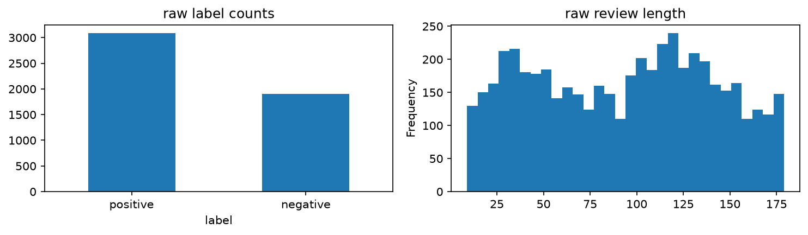
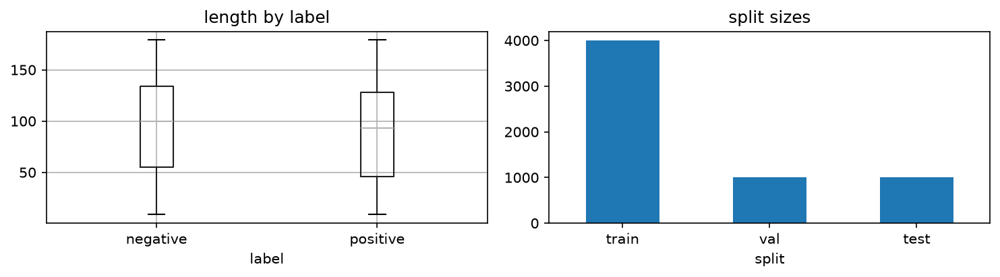
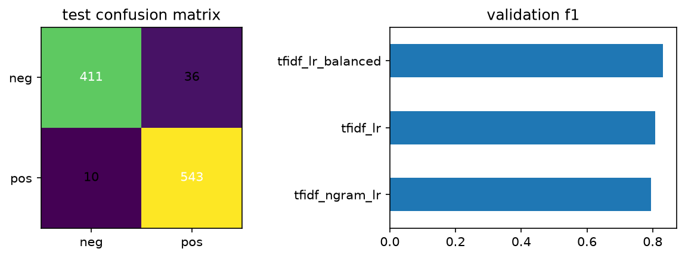

# Amazon Reviews Sentiment Analysis

Binary sentiment classification on [Cleanlab/amazon-reviews](https://huggingface.co/datasets/Cleanlab/amazon-reviews) (5k train / 1k test). Pipeline: ETL → optional Cleanlab → TF-IDF + LogisticRegression → test evaluation.

```bash
uv venv .venv
uv pip install -r requirements.txt
python main.py
```

Outputs: `processed/` (clean splits, `quarantine.csv`, `issues.csv`, `validation_report.json`, `metrics.json`, plots).

## EDA

<p align="center">
  
  <br><em>1. Raw label counts and review length distribution</em>
</p>

<p align="center">
  
  <br><em>2. Cleaned review length by label and split sizes</em>
</p>

<p align="center">
  
  <br><em>3. Test confusion matrix and validation F1 by candidate</em>
</p>
